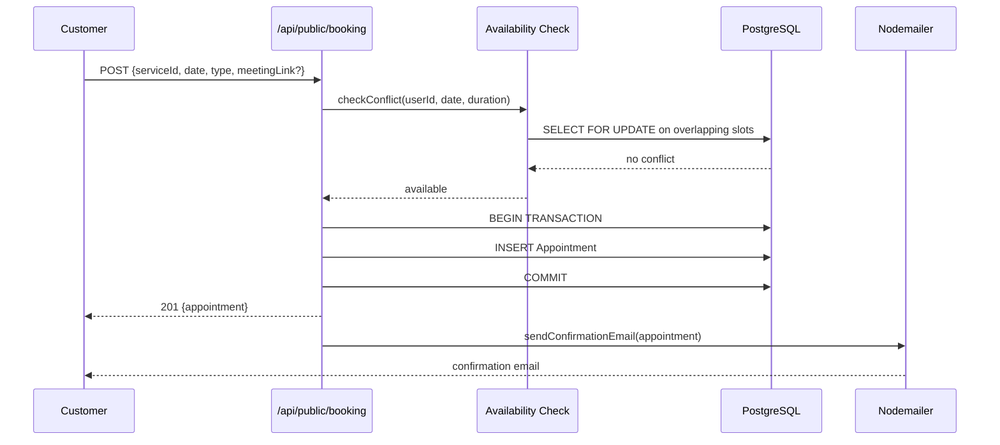
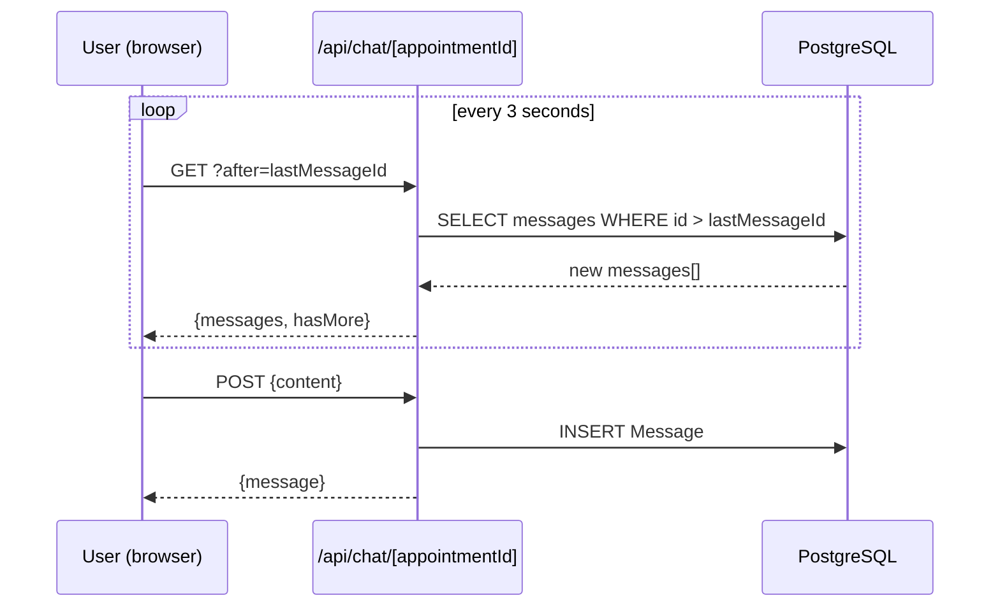
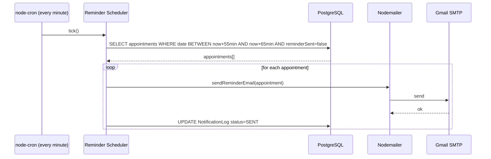

# Design Document: Hospital Appointment Management System

## Overview

This document describes the technical design for extending the existing hospital appointment management system with six major feature areas: real-time chat messaging, reviews and ratings, online/offline appointment types, dynamic availability scheduling, email notifications, and an admin analytics dashboard.

The system is built on Next.js 16.1.1 (App Router), React 19, PostgreSQL with Prisma ORM, and NextAuth v4. All new features integrate into this existing stack without replacing any existing functionality.

### Key Design Decisions

- **Chat uses REST polling** (not WebSocket) as the primary delivery mechanism. Next.js App Router does not support persistent WebSocket servers natively. Polling every 3–5 seconds is sufficient for appointment-context chat. A WebSocket upgrade path is documented but not implemented in the initial version.
- **Email uses Nodemailer** with Gmail/SMTP. A job-queue approach using a lightweight in-process scheduler (`node-cron`) handles reminders and retries without requiring a separate worker process.
- **Analytics uses Recharts** for visualizations. Prisma aggregation queries handle all metrics; no materialized views are needed at the initial scale.
- **Availability conflict detection uses database-level transactions** with `SELECT FOR UPDATE` to prevent race conditions.
- **All times are stored in UTC**; conversion to user timezone happens at the API response layer.

---

## Architecture

```mermaid
graph TB
    subgraph Client["Browser (React 19)"]
        UI[Next.js Pages / Components]
        Poll[Chat Polling Hook]
        Charts[Recharts Dashboard]
    end

    subgraph Server["Next.js App Router (API Routes)"]
        Auth[NextAuth v4]
        ChatAPI[/api/chat/]
        ReviewAPI[/api/reviews/]
        AvailAPI[/api/availability/]
        AnalyticsAPI[/api/admin/analytics]
        NotifAPI[/api/notifications/]
        Scheduler[node-cron Scheduler]
    end

    subgraph Data["Data Layer"]
        Prisma[Prisma ORM]
        PG[(PostgreSQL)]
    end

    subgraph External["External Services"]
        SMTP[Gmail / SMTP]
        Nodemailer[Nodemailer]
    end

    UI --> Auth
    UI --> ChatAPI
    UI --> ReviewAPI
    UI --> AvailAPI
    UI --> AnalyticsAPI
    Poll --> ChatAPI
    Charts --> AnalyticsAPI

    ChatAPI --> Prisma
    ReviewAPI --> Prisma
    AvailAPI --> Prisma
    AnalyticsAPI --> Prisma
    NotifAPI --> Nodemailer

    Scheduler --> NotifAPI
    Nodemailer --> SMTP
    Prisma --> PG
```

### Data Flow: Booking Flow



### Data Flow: Chat Polling



### Data Flow: Notification Flow



---

## Components and Interfaces

### New API Routes

| Method | Path | Auth | Description |
|--------|------|------|-------------|
| GET | `/api/chat/[appointmentId]` | USER/ADMIN | Fetch messages (paginated, supports `?after=id`) |
| POST | `/api/chat/[appointmentId]` | USER/ADMIN | Send a message |
| GET | `/api/reviews` | PUBLIC | List reviews (filter by serviceId, domainId) |
| POST | `/api/reviews` | USER | Submit a review |
| GET | `/api/reviews/[id]` | PUBLIC | Get single review |
| PUT | `/api/reviews/[id]` | ADMIN | Update review (flag, respond, moderate) |
| DELETE | `/api/reviews/[id]` | ADMIN | Delete review |
| GET | `/api/availability` | USER/ADMIN | Get available slots (filter by userId, date range, type) |
| POST | `/api/availability` | ADMIN | Create slot or recurring pattern |
| DELETE | `/api/availability/[id]` | ADMIN | Delete slot or pattern |
| GET | `/api/admin/analytics` | ADMIN | Aggregated analytics (query params: period, type, serviceId, domainId) |
| GET | `/api/admin/analytics/export` | ADMIN | Stream CSV export |
| POST | `/api/notifications/send` | ADMIN | Manually trigger a notification |
| GET | `/api/admin/notifications` | ADMIN | Notification log (filter by customer, date) |

### React Components

| Component | Path | Description |
|-----------|------|-------------|
| `ChatPanel` | `src/components/chat/ChatPanel.tsx` | Full chat UI with polling, message list, input |
| `MessageBubble` | `src/components/chat/MessageBubble.tsx` | Individual message with read indicator |
| `ReviewForm` | `src/components/reviews/ReviewForm.tsx` | Star rating + text feedback form |
| `StarRating` | `src/components/reviews/StarRating.tsx` | Interactive/display star rating |
| `ReviewList` | `src/components/reviews/ReviewList.tsx` | Paginated review list with helpful votes |
| `AvailabilityCalendar` | `src/components/availability/AvailabilityCalendar.tsx` | Weekly calendar grid for slot management |
| `RecurringPatternForm` | `src/components/availability/RecurringPatternForm.tsx` | Form for creating recurring patterns |
| `AppointmentTypeSelector` | `src/components/appointments/AppointmentTypeSelector.tsx` | ONLINE/OFFLINE toggle with meeting link input |
| `AnalyticsDashboard` | `src/components/analytics/AnalyticsDashboard.tsx` | Full analytics page with Recharts |
| `MetricCard` | `src/components/analytics/MetricCard.tsx` | Single KPI card |
| `EmailTemplateEditor` | `src/components/admin/EmailTemplateEditor.tsx` | Template editor with placeholder preview |

### Key Function Signatures

```typescript
// src/lib/chat.ts
export async function getMessages(appointmentId: string, after?: string, limit = 50): Promise<Message[]>
export async function sendMessage(appointmentId: string, senderId: string, senderRole: Role, content: string): Promise<Message>
export async function markMessagesRead(appointmentId: string, userId: string): Promise<void>

// src/lib/availability.ts
export async function checkConflict(userId: string, startTime: Date, endTime: Date, excludeAppointmentId?: string): Promise<boolean>
export async function getAvailableSlots(userId: string, date: Date, serviceDuration: number, type: AppointmentType): Promise<TimeSlot[]>
export async function generateSlotsFromPattern(pattern: AvailabilityPattern): Promise<Availability[]>

// src/lib/notifications.ts
export async function sendAppointmentEmail(type: NotificationType, appointment: AppointmentWithRelations): Promise<void>
export async function scheduleReminders(): Promise<void>
export async function retryFailedNotifications(): Promise<void>
export function renderTemplate(template: string, vars: Record<string, string>): string

// src/lib/analytics.ts
export async function getAppointmentStats(period: Period, filters: AnalyticsFilters): Promise<AppointmentStats>
export async function getRevenueStats(period: Period, filters: AnalyticsFilters): Promise<RevenueStats>
export async function getTimeSeries(metric: 'appointments' | 'revenue', months: number): Promise<TimeSeriesPoint[]>
export async function getDerivedMetrics(filters: AnalyticsFilters): Promise<DerivedMetrics>
export async function exportToCsv(type: ExportType, filters: AnalyticsFilters): AsyncGenerator<string>
```

---

## Data Models

### Prisma Schema Additions

```prisma
// Extend existing enums
enum AppointmentType {
  ONLINE
  OFFLINE
}

enum NotificationType {
  CONFIRMATION
  CANCELLATION
  REMINDER_24H
  REMINDER_1H
  UPDATE
  MEETING_LINK_CHANGED
}

enum NotificationStatus {
  PENDING
  SENT
  DELIVERED
  FAILED
  BOUNCED
}

enum DayOfWeek {
  MONDAY
  TUESDAY
  WEDNESDAY
  THURSDAY
  FRIDAY
  SATURDAY
  SUNDAY
}

// Extend User model (add fields)
// timezone  String  @default("UTC")

// Extend Appointment model (add fields)
// type        AppointmentType  @default(OFFLINE)
// meetingLink String?

// Extend Service model (add fields)
// supportedTypes  AppointmentType[]  @default([OFFLINE])

model Message {
  id            String      @id @default(cuid())
  appointmentId String
  appointment   Appointment @relation(fields: [appointmentId], references: [id], onDelete: Cascade)
  senderId      String
  sender        User        @relation("SentMessages", fields: [senderId], references: [id])
  content       String      @db.VarChar(2000)
  isRead        Boolean     @default(false)
  readAt        DateTime?
  isArchived    Boolean     @default(false)
  createdAt     DateTime    @default(now())
}

model Review {
  id            String       @id @default(cuid())
  appointmentId String       @unique
  appointment   Appointment  @relation(fields: [appointmentId], references: [id])
  customerId    String
  customer      Customer     @relation(fields: [customerId], references: [id])
  serviceId     String
  service       Service      @relation(fields: [serviceId], references: [id])
  rating        Int          // 1-5
  feedback      String?      @db.VarChar(1000)
  isFlagged     Boolean      @default(false)
  isHidden      Boolean      @default(false)
  adminResponse String?
  adminId       String?
  flaggedAt     DateTime?
  createdAt     DateTime     @default(now())
  updatedAt     DateTime     @updatedAt
  votes         ReviewVote[]
}

model ReviewVote {
  id        String   @id @default(cuid())
  reviewId  String
  review    Review   @relation(fields: [reviewId], references: [id], onDelete: Cascade)
  userId    String
  user      User     @relation(fields: [userId], references: [id])
  createdAt DateTime @default(now())

  @@unique([reviewId, userId])
}

model Availability {
  id          String            @id @default(cuid())
  userId      String
  user        User              @relation(fields: [userId], references: [id], onDelete: Cascade)
  startTime   DateTime          // UTC
  endTime     DateTime          // UTC
  isAvailable Boolean           @default(true)
  patternId   String?
  pattern     AvailabilityPattern? @relation(fields: [patternId], references: [id], onDelete: SetNull)
  bufferMinutes Int             @default(0)
  createdAt   DateTime          @default(now())
  updatedAt   DateTime          @updatedAt
}

model AvailabilityPattern {
  id            String        @id @default(cuid())
  userId        String
  user          User          @relation(fields: [userId], references: [id], onDelete: Cascade)
  dayOfWeek     DayOfWeek[]
  startTime     String        // "HH:MM" in admin's local time
  endTime       String        // "HH:MM" in admin's local time
  effectiveFrom DateTime
  effectiveTo   DateTime?
  bufferMinutes Int           @default(0)
  createdAt     DateTime      @default(now())
  slots         Availability[]
}

model NotificationLog {
  id             String             @id @default(cuid())
  appointmentId  String
  appointment    Appointment        @relation(fields: [appointmentId], references: [id])
  customerId     String
  customer       Customer           @relation(fields: [customerId], references: [id])
  type           NotificationType
  status         NotificationStatus @default(PENDING)
  recipientEmail String
  subject        String
  retryCount     Int                @default(0)
  sentAt         DateTime?
  failedAt       DateTime?
  errorMessage   String?
  createdAt      DateTime           @default(now())
  updatedAt      DateTime           @updatedAt
}

model EmailTemplate {
  id          String   @id @default(cuid())
  type        NotificationType @unique
  subject     String
  htmlBody    String   @db.Text
  textBody    String   @db.Text
  domainId    String?
  domain      Domain?  @relation(fields: [domainId], references: [id], onDelete: SetNull)
  isActive    Boolean  @default(true)
  createdAt   DateTime @default(now())
  updatedAt   DateTime @updatedAt
}
```

### Migration Strategy

New fields on existing tables use `ALTER TABLE ... ADD COLUMN` with defaults so existing rows are not broken:

```sql
-- Appointment extensions
ALTER TABLE "Appointment" ADD COLUMN "type" TEXT NOT NULL DEFAULT 'OFFLINE';
ALTER TABLE "Appointment" ADD COLUMN "meetingLink" TEXT;

-- Service extensions  
ALTER TABLE "Service" ADD COLUMN "supportedTypes" TEXT[] NOT NULL DEFAULT ARRAY['OFFLINE'];

-- User extensions
ALTER TABLE "User" ADD COLUMN "timezone" TEXT NOT NULL DEFAULT 'UTC';
```

All new models are additive (new tables) and do not affect existing queries.

### Database Indexes

```sql
-- Chat performance
CREATE INDEX idx_message_appointment ON "Message"("appointmentId", "createdAt");
CREATE INDEX idx_message_sender ON "Message"("senderId");

-- Review performance
CREATE INDEX idx_review_service ON "Review"("serviceId", "createdAt" DESC);
CREATE INDEX idx_review_customer ON "Review"("customerId");

-- Availability conflict detection (critical path)
CREATE INDEX idx_availability_user_time ON "Availability"("userId", "startTime", "endTime");

-- Analytics query optimization
CREATE INDEX idx_appointment_date_status ON "Appointment"("date", "status");
CREATE INDEX idx_appointment_service_date ON "Appointment"("serviceId", "date");
CREATE INDEX idx_appointment_domain_date ON "Appointment"("domainId", "date");

-- Notification log
CREATE INDEX idx_notif_appointment ON "NotificationLog"("appointmentId");
CREATE INDEX idx_notif_status ON "NotificationLog"("status", "createdAt");
```

---

## Correctness Properties

*A property is a characteristic or behavior that should hold true across all valid executions of a system — essentially, a formal statement about what the system should do. Properties serve as the bridge between human-readable specifications and machine-verifiable correctness guarantees.*

### Property 1: Message field completeness

*For any* message sent through the chat system, the stored message must contain a non-null sender ID, appointment ID, timestamp, and content of length ≤ 2000 characters.

**Validates: Requirements 1.1, 1.4**

### Property 2: Message chronological ordering

*For any* appointment with N messages, retrieving messages for that appointment must return them ordered by `createdAt` ascending.

**Validates: Requirements 1.3**

### Property 3: Message read state transition

*For any* set of unread messages in an appointment, after the recipient views the appointment, all those messages must have `isRead = true`.

**Validates: Requirements 1.6**

### Property 4: Chat authorization — ownership enforcement

*For any* user with role USER and any appointment not owned by that user, attempting to send a message to that appointment must return a 403 error.

**Validates: Requirements 1.8**

### Property 5: Chat authorization — admin bypass

*For any* user with role ADMIN and any appointment, sending a message must succeed regardless of appointment ownership.

**Validates: Requirements 1.9**

### Property 6: Review only on completed appointments

*For any* appointment with status other than COMPLETED, attempting to submit a review must return an error and no review must be stored.

**Validates: Requirements 2.1, 2.11**

### Property 7: Review rating bounds

*For any* rating value outside the range [1, 5], submitting a review with that rating must be rejected.

**Validates: Requirements 2.2**

### Property 8: Review uniqueness per appointment

*For any* appointment that already has a review, submitting a second review for the same appointment must be rejected.

**Validates: Requirements 2.5**

### Property 9: Review aggregation correctness

*For any* service with N reviews having ratings r₁…rN, the API must return an average rating equal to sum(r₁…rN)/N and a count equal to N.

**Validates: Requirements 2.6, 2.7**

### Property 10: Flagged reviews hidden from public

*For any* review that has been flagged, it must not appear in the public review listing for its service.

**Validates: Requirements 2.9, 2.10**

### Property 11: Online appointment requires meeting link

*For any* appointment creation request with type ONLINE and no meeting link, the request must be rejected with a validation error.

**Validates: Requirements 3.3**

### Property 12: Offline appointment requires domain

*For any* appointment creation request with type OFFLINE and no domain ID, the request must be rejected with a validation error.

**Validates: Requirements 3.4**

### Property 13: Appointment type and link persistence

*For any* appointment created with a specific type and meeting link, retrieving that appointment must return the same type and meeting link.

**Validates: Requirements 3.5, 3.10**

### Property 14: Slot type filtering

*For any* availability query with a specified appointment type, all returned slots must support that appointment type.

**Validates: Requirements 3.9**

### Property 15: Recurring pattern slot generation

*For any* recurring pattern spanning D days that match the pattern's day-of-week configuration, creating the pattern must generate exactly D availability slots.

**Validates: Requirements 4.3**

### Property 16: Booked slots excluded from available slots

*For any* time slot that has a confirmed appointment, that slot must not appear in the available slots returned to customers.

**Validates: Requirements 4.5**

### Property 17: Conflict detection with duration

*For any* two appointments for the same admin where appointment A occupies [start_A, start_A + duration_A] and appointment B starts within that interval, the system must reject appointment B.

**Validates: Requirements 4.6, 4.7, 4.8**

### Property 18: Buffer time included in conflict window

*For any* admin with buffer time B minutes configured, an appointment starting less than B minutes after the end of an existing appointment must be rejected as a conflict.

**Validates: Requirements 4.11, 4.12**

### Property 19: Pattern deletion removes future slots

*For any* recurring pattern with future slots, deleting the pattern must result in all future unbooked slots being removed.

**Validates: Requirements 4.9**

### Property 20: Booked slots preserved on pattern modification

*For any* slot that has a confirmed appointment, modifying or deleting the parent pattern must not remove that slot.

**Validates: Requirements 4.10**

### Property 21: Reminder scheduling correctness

*For any* appointment scheduled at time T, the reminder scheduler must identify it as needing a 24h reminder when the current time is in [T-25h, T-23h] and a 1h reminder when in [T-65min, T-55min].

**Validates: Requirements 5.5, 5.6**

### Property 22: Email content includes location info

*For any* ONLINE appointment, the rendered email must contain the meeting link. *For any* OFFLINE appointment, the rendered email must contain the domain address.

**Validates: Requirements 5.7, 5.8**

### Property 23: Template placeholder substitution

*For any* email template with placeholders `{{key}}` and a variables map, rendering the template must replace every placeholder with its corresponding value and leave no unresolved `{{...}}` tokens.

**Validates: Requirements 5.12**

### Property 24: Unsubscribe preserves critical notifications

*For any* customer who has unsubscribed from reminders, the notification system must not send REMINDER_24H or REMINDER_1H emails but must still send CONFIRMATION and CANCELLATION emails.

**Validates: Requirements 5.13**

### Property 25: Analytics count correctness

*For any* set of appointments in a given period, the analytics count endpoint must return a value equal to the actual count of appointments in that period.

**Validates: Requirements 6.1, 6.2**

### Property 26: Revenue aggregation correctness

*For any* set of COMPLETED appointments, the total revenue must equal the sum of each appointment's service price. Revenue grouped by service or domain must equal the sum for that group.

**Validates: Requirements 6.3, 6.4, 6.5**

### Property 27: Time-series completeness

*For any* request for 12-month time-series data, the response must contain exactly 12 data points, one per calendar month, with no gaps.

**Validates: Requirements 6.8, 6.9**

### Property 28: Derived metrics correctness

*For any* dataset, the no-show rate must equal cancelled_count / total_count, the retention rate must equal customers_with_2+_appointments / total_customers, and the top services ranking must be consistent with appointment counts and revenue totals.

**Validates: Requirements 6.6, 6.13, 6.14**

### Property 29: CSV export validity

*For any* analytics export request, the output must be valid CSV with a header row, and every data row must have the same number of columns as the header.

**Validates: Requirements 6.16, 11.1, 11.4**

---

## Error Handling

### API Error Response Shape

All API routes return a consistent error shape:

```typescript
type ApiError = {
  message: string        // human-readable
  code?: string          // machine-readable e.g. "CONFLICT_DETECTED"
  details?: unknown      // validation errors, suggestions
}
```

### Error Scenarios by Feature

**Chat**
- `403 FORBIDDEN` — user tries to message an appointment they don't own
- `400 MESSAGE_TOO_LONG` — content exceeds 2000 chars
- `404 APPOINTMENT_NOT_FOUND` — invalid appointmentId

**Reviews**
- `409 REVIEW_EXISTS` — duplicate review for same appointment
- `400 INVALID_RATING` — rating outside 1–5
- `403 APPOINTMENT_NOT_COMPLETED` — appointment not in COMPLETED status
- `429 RATE_LIMITED` — more than 1 review per hour per customer

**Availability**
- `409 CONFLICT_DETECTED` — overlapping appointment; response includes `details.suggestions[]` with next 3 available slots
- `400 OUTSIDE_AVAILABILITY` — requested time not within admin's defined slots
- `400 INVALID_TIME_RANGE` — endTime ≤ startTime

**Notifications**
- Email failures are caught, logged to `NotificationLog`, and retried up to 3 times with exponential backoff (1s, 2s, 4s delays). After 3 failures, status is set to `FAILED` and an admin alert is queued.

**Analytics**
- `400 INVALID_PERIOD` — unrecognized period value
- Large exports stream via `ReadableStream` to avoid memory exhaustion; if row count exceeds 100,000, the response includes a `X-Export-Split: true` header and the client receives multiple files.

### Input Validation

All API routes use a thin validation layer (manual checks or `zod`) before touching the database:

```typescript
// Example: review submission validation
const schema = z.object({
  appointmentId: z.string().cuid(),
  rating: z.number().int().min(1).max(5),
  feedback: z.string().max(1000).optional(),
})
```

### Rate Limiting

Applied at the API route level using an in-memory sliding window (suitable for single-instance deployment; replace with Redis for multi-instance):

- Chat: 60 messages/minute per user
- Reviews: 1 review/hour per customer
- Public booking: 10 requests/minute per IP

---

## Testing Strategy

### Dual Testing Approach

Both unit tests and property-based tests are required. They are complementary:
- **Unit tests** cover specific examples, integration points, and error conditions
- **Property tests** verify universal correctness across randomized inputs

### Property-Based Testing

Use **fast-check** (TypeScript-native PBT library) for all property tests.

Install: `npm install --save-dev fast-check`

Each property test must run a minimum of **100 iterations** and be tagged with a comment referencing the design property:

```typescript
// Feature: hospital-appointment-system, Property 9: Review aggregation correctness
it('calculates correct average rating for any set of reviews', () => {
  fc.assert(
    fc.property(
      fc.array(fc.integer({ min: 1, max: 5 }), { minLength: 1 }),
      (ratings) => {
        const expected = ratings.reduce((a, b) => a + b, 0) / ratings.length
        const result = calculateAverageRating(ratings)
        return Math.abs(result - expected) < 0.001
      }
    ),
    { numRuns: 100 }
  )
})
```

### Property Test Coverage Map

| Property | Test File | Generator Strategy |
|----------|-----------|-------------------|
| P1: Message field completeness | `__tests__/chat.property.test.ts` | `fc.record({ content: fc.string({ maxLength: 2000 }) })` |
| P2: Message ordering | `__tests__/chat.property.test.ts` | `fc.array(fc.date())` shuffled, verify sort |
| P3: Message read state | `__tests__/chat.property.test.ts` | `fc.array(fc.record({ isRead: fc.constant(false) }))` |
| P4–P5: Chat auth | `__tests__/chat.property.test.ts` | `fc.record({ role: fc.constantFrom('USER', 'ADMIN') })` |
| P6: Review on completed | `__tests__/reviews.property.test.ts` | `fc.constantFrom('PENDING', 'CONFIRMED', 'CANCELLED')` |
| P7: Rating bounds | `__tests__/reviews.property.test.ts` | `fc.oneof(fc.integer({ max: 0 }), fc.integer({ min: 6 }))` |
| P8: Review uniqueness | `__tests__/reviews.property.test.ts` | Submit same appointmentId twice |
| P9: Review aggregation | `__tests__/reviews.property.test.ts` | `fc.array(fc.integer({ min: 1, max: 5 }), { minLength: 1 })` |
| P10: Flagged hidden | `__tests__/reviews.property.test.ts` | Generate reviews, flag subset, verify exclusion |
| P11–P12: Type validation | `__tests__/appointments.property.test.ts` | `fc.record({ type: fc.constant('ONLINE'), meetingLink: fc.constant(undefined) })` |
| P15: Pattern slot generation | `__tests__/availability.property.test.ts` | `fc.record({ days: fc.subarray([0..6]), weeks: fc.integer({ min: 1, max: 52 }) })` |
| P16: Booked slots excluded | `__tests__/availability.property.test.ts` | Book N slots, verify none in available |
| P17–P18: Conflict detection | `__tests__/availability.property.test.ts` | `fc.record({ start: fc.date(), duration: fc.integer({ min: 15, max: 120 }) })` |
| P21: Reminder scheduling | `__tests__/notifications.property.test.ts` | `fc.date()` relative to now |
| P22–P23: Email content | `__tests__/notifications.property.test.ts` | `fc.record({ type: fc.constantFrom('ONLINE', 'OFFLINE') })` |
| P25–P28: Analytics | `__tests__/analytics.property.test.ts` | `fc.array(fc.record({ status, price, date }))` |
| P29: CSV validity | `__tests__/analytics.property.test.ts` | Parse output with csv-parse, verify structure |

### Unit Test Coverage

Unit tests focus on:
- Auth middleware (session checks, role guards)
- Email template rendering with specific placeholder values
- Conflict detection edge cases (exact boundary times, zero-duration)
- Retry logic (mock Nodemailer to fail N times)
- CSV streaming for large datasets
- Public booking endpoint integration (customer find-or-create)

Test framework: **Jest** (already compatible with Next.js).

```bash
# Run all tests once (no watch mode)
npx jest --runInBand
```
