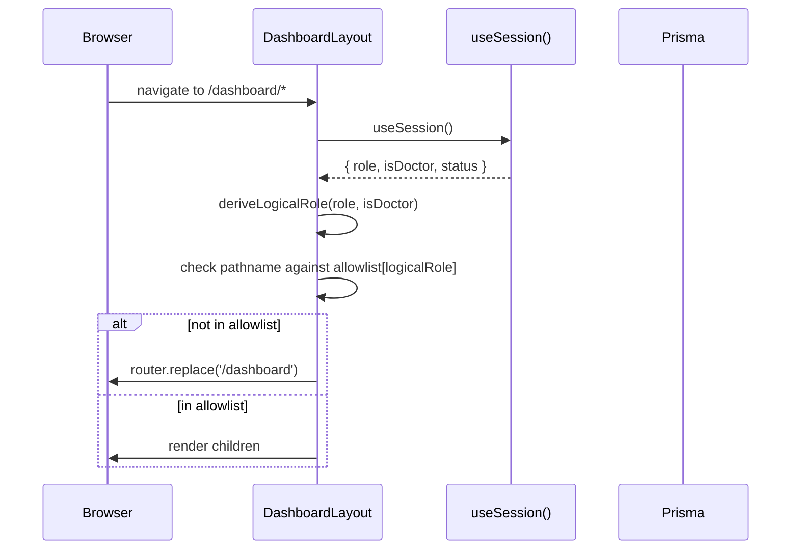

# Design Document: Role-Based Sidebar

## Overview

This feature transforms the dashboard from a single-view application into a fully role-aware system. The three logical roles — Admin, Doctor, and Patient — each receive a tailored sidebar navigation, a role-specific dashboard landing page, and access to role-appropriate pages. The work also introduces a `DoctorProfile` model to distinguish doctors from patients within the existing `USER` role, propagates an `isDoctor` flag through the NextAuth JWT pipeline, and adds route-level access control to the dashboard layout.

### Key Design Decisions

- **No new Role enum value**: Doctors are identified by the presence of a `DoctorProfile` record rather than a new `DOCTOR` enum value. This avoids a breaking migration and keeps the auth system simple.
- **Logical role derived client-side and server-side**: The `(role, isDoctor)` pair is available on `session.user` so both the layout (client) and API routes (server) can derive the logical role without an extra DB query.
- **Inline sidebar stays in `layout.tsx`**: The existing `Sidebar.tsx` component is already commented out and unused. The sidebar remains inline in `layout.tsx` to avoid introducing a new component boundary that would complicate the `sidebarOpen` state.
- **`localStorage` for sidebar persistence**: Simple, zero-dependency persistence that survives page navigation within the session.

---

## Architecture

```mermaid
graph TD
    subgraph "Auth Pipeline"
        A[User Login] --> B[authorize callback\nquery DoctorProfile\nreturn isDoctor]
        B --> C[jwt callback\npersist isDoctor on token]
        C --> D[session callback\nexpose isDoctor on session.user]
    end

    subgraph "Client: Dashboard Layout"
        D --> E[useSession\nderive logicalRole]
        E --> F{logicalRole}
        F -->|Admin| G[Admin nav items]
        F -->|Doctor| H[Doctor nav items]
        F -->|Patient| I[Patient nav items]
        E --> J[Route Guard\nallowlist check]
        J -->|not allowed| K[redirect /dashboard]
        J -->|unauthenticated| L[redirect /auth/login]
    end

    subgraph "Dashboard Page"
        E --> M{logicalRole}
        M -->|Admin| N[/api/admin/* stats]
        M -->|Doctor| O[/api/dashboard/doctor-stats]
        M -->|Patient| P[/api/dashboard/patient-stats]
    end

    subgraph "New Pages"
        Q[/dashboard/open-slots\nPatient] --> R[/api/slots/open]
        S[/dashboard/slots\nDoctor] --> T[/api/slots/my-slots]
    end
```

### Data Flow: Logical Role Derivation



---

## Components and Interfaces

### TypeScript Interfaces

```typescript
// Logical role type — derived, never stored
type LogicalRole = 'admin' | 'doctor' | 'patient'

// Extended session user (augments next-auth types)
interface SessionUser {
  id: string
  name?: string | null
  email?: string | null
  role: 'ADMIN' | 'USER'
  isDoctor: boolean
}

// Nav item definition used to build the sidebar and the route allowlist
interface NavItem {
  label: string
  href: string
  icon: React.ElementType
  /** If true, this item has an expandable sub-list (Departments) */
  expandable?: boolean
}

// Per-role nav configuration
interface RoleNavConfig {
  items: NavItem[]
  /** Routes the role is allowed to visit (prefix-matched) */
  allowlist: string[]
}

// Dashboard stat card
interface StatCard {
  label: string
  value: number
  icon: React.ElementType
  colorClass: string
  subLabel: string
}

// API response shapes
interface AdminStats {
  totalUsers: number
  totalAppointments: number
  pendingAppointments: number
  totalCustomers: number
  totalServices: number
}

interface DoctorStats {
  totalAppointments: number
  pendingAppointments: number
  distinctPatients: number
}

interface PatientStats {
  upcomingAppointments: number
  pastAppointments: number
}

interface OpenSlot {
  id: string
  departmentName: string
  doctorName: string
  slotDate: string        // ISO date string
  remainingCapacity: number
}

interface DoctorSlot {
  id: string
  departmentName: string
  slotDate: string
  slotLimit: number
  bookingCount: number
  isOpen: boolean
}
```

### NextAuth Type Augmentation

The existing `next-auth.d.ts` (or a new one at `frontend/src/types/next-auth.d.ts`) must be extended:

```typescript
import NextAuth, { DefaultSession } from 'next-auth'
import { JWT } from 'next-auth/jwt'

declare module 'next-auth' {
  interface Session {
    user: {
      id: string
      role: string
      isDoctor: boolean
    } & DefaultSession['user']
  }

  interface User {
    id: string
    role: string
    isDoctor: boolean
  }
}

declare module 'next-auth/jwt' {
  interface JWT {
    id: string
    role: string
    isDoctor: boolean
  }
}
```

### Role Nav Configuration (defined in `layout.tsx`)

```typescript
function deriveLogicalRole(role: string, isDoctor: boolean): LogicalRole {
  if (role === 'ADMIN') return 'admin'
  if (isDoctor) return 'doctor'
  return 'patient'
}

const NAV_CONFIG: Record<LogicalRole, RoleNavConfig> = {
  admin: {
    items: [
      { label: 'Dashboard',     href: '/dashboard',              icon: LayoutDashboard },
      { label: 'Patients',      href: '/dashboard/customers',    icon: Users },
      { label: 'Appointments',  href: '/dashboard/appointments', icon: Calendar },
      { label: 'Departments',   href: '/dashboard/services',     icon: Stethoscope, expandable: true },
      { label: 'Manage Slots',  href: '/dashboard/admin/slots',  icon: Clock },
    ],
    allowlist: [
      '/dashboard',
      '/dashboard/customers',
      '/dashboard/appointments',
      '/dashboard/services',
      '/dashboard/admin/slots',
      '/dashboard/settings',
    ],
  },
  doctor: {
    items: [
      { label: 'Dashboard',    href: '/dashboard',              icon: LayoutDashboard },
      { label: 'Appointments', href: '/dashboard/appointments', icon: Calendar },
      { label: 'Patients',     href: '/dashboard/customers',    icon: Users },
      { label: 'My Slots',     href: '/dashboard/slots',        icon: Clock },
    ],
    allowlist: [
      '/dashboard',
      '/dashboard/appointments',
      '/dashboard/customers',
      '/dashboard/slots',
      '/dashboard/settings',
    ],
  },
  patient: {
    items: [
      { label: 'Dashboard',       href: '/dashboard',                icon: LayoutDashboard },
      { label: 'My Appointments', href: '/dashboard/my-appointments', icon: Calendar },
      { label: 'Open Slots',      href: '/dashboard/open-slots',     icon: Clock },
      { label: 'Departments',     href: '/dashboard/services',       icon: Stethoscope, expandable: true },
    ],
    allowlist: [
      '/dashboard',
      '/dashboard/my-appointments',
      '/dashboard/open-slots',
      '/dashboard/services',
      '/dashboard/settings',
    ],
  },
}
```

---

## Data Models

### Prisma Schema Changes

Add `DoctorProfile` model and update `User`:

```prisma
model DoctorProfile {
  id             String   @id @default(cuid())
  userId         String   @unique
  user           User     @relation(fields: [userId], references: [id], onDelete: Cascade)
  specialization String?
  createdAt      DateTime @default(now())
  updatedAt      DateTime @updatedAt
}
```

Update `User` model to add the relation field:

```prisma
model User {
  // ... existing fields ...
  doctorProfile  DoctorProfile?
}
```

A Prisma migration will be generated with `prisma migrate dev --name add_doctor_profile`.

### AppointmentSlot — No Schema Changes

The existing `AppointmentSlot` model already has `isOpen`, `doctorName`, `slotLimit`, `slotDate`, and a relation to `Service`. The new API routes query this model directly. The `bookingCount` for a slot is derived by counting `Appointment` records with `slotId = slot.id`.

---

## API Routes

### Modified: `GET /api/auth/[...nextauth]`

The `authorize` callback gains a `DoctorProfile` lookup:

```typescript
async authorize(credentials) {
  const user = await prisma.user.findUnique({
    where: { email: credentials.email },
    include: { doctorProfile: true },   // ← new
  })
  // ...password check...
  return {
    id: user.id,
    name: user.fullName,
    email: user.email,
    role: user.role,
    isDoctor: user.doctorProfile !== null,  // ← new
  }
}
```

JWT and session callbacks:

```typescript
async jwt({ token, user }) {
  if (user) {
    token.id = user.id
    token.role = (user as any).role
    token.isDoctor = (user as any).isDoctor  // ← new
  }
  return token
},
async session({ session, token }) {
  if (session.user) {
    session.user.id = token.id as string
    session.user.role = token.role as string
    session.user.isDoctor = token.isDoctor as boolean  // ← new
  }
  return session
},
```

### New: `GET /api/dashboard/doctor-stats`

Returns stats scoped to the authenticated doctor (identified by `session.user.id`).

```
Response: { totalAppointments: number, pendingAppointments: number, distinctPatients: number }
```

Implementation queries:
- `prisma.appointment.count({ where: { userId: session.user.id } })`
- `prisma.appointment.count({ where: { userId: session.user.id, status: 'PENDING' } })`
- `prisma.appointment.findMany({ where: { userId: session.user.id }, select: { customerId: true }, distinct: ['customerId'] })` → `.length`

### New: `GET /api/dashboard/patient-stats`

Returns stats scoped to the authenticated patient (identified by `session.user.id`).

```
Response: { upcomingAppointments: number, pastAppointments: number }
```

Implementation queries:
- `prisma.appointment.count({ where: { patientId: session.user.id, date: { gte: now }, status: { not: 'CANCELLED' } } })`
- `prisma.appointment.count({ where: { patientId: session.user.id, status: 'COMPLETED' } })`

### New: `GET /api/slots/open`

Returns all `AppointmentSlot` records where `isOpen = true`, with department name and remaining capacity.

```
Response: OpenSlot[]
```

Implementation:
```typescript
const slots = await prisma.appointmentSlot.findMany({
  where: { isOpen: true },
  include: {
    service: { select: { name: true } },
    _count: { select: { appointments: true } },
  },
  orderBy: { slotDate: 'asc' },
})
// remainingCapacity = slot.slotLimit - slot._count.appointments
```

### New: `GET /api/slots/my-slots`

Returns `AppointmentSlot` records for the authenticated doctor, matched by `doctorName` against the user's `fullName`.

```
Response: DoctorSlot[]
```

Implementation:
```typescript
const user = await prisma.user.findUnique({ where: { id: session.user.id } })
const slots = await prisma.appointmentSlot.findMany({
  where: { doctorName: user.fullName },
  include: {
    service: { select: { name: true } },
    _count: { select: { appointments: true } },
  },
  orderBy: { slotDate: 'asc' },
})
```

> **Note**: The current `AppointmentSlot` model stores `doctorName` as a plain string rather than a foreign key to `User`. Matching by `fullName` is the pragmatic approach given the existing schema. A future migration could add a `doctorId` FK for stronger integrity.

---

## Correctness Properties

*A property is a characteristic or behavior that should hold true across all valid executions of a system — essentially, a formal statement about what the system should do. Properties serve as the bridge between human-readable specifications and machine-verifiable correctness guarantees.*

### Property 1: isDoctor propagates correctly through the auth pipeline

*For any* user record, if the user has an associated `DoctorProfile` record then `isDoctor` should be `true` in the returned session; if the user has no `DoctorProfile` then `isDoctor` should be `false`. This property covers the full chain: `authorize` → `jwt` → `session`.

**Validates: Requirements 1.4, 1.5, 1.6**

### Property 2: Logical role derivation is correct for all input combinations

*For any* combination of `role` (`'ADMIN'` | `'USER'`) and `isDoctor` (`true` | `false`), the `deriveLogicalRole` function should return `'admin'` when `role === 'ADMIN'`, `'doctor'` when `role === 'USER' && isDoctor === true`, and `'patient'` when `role === 'USER' && isDoctor === false`.

**Validates: Requirements 1.7**

### Property 3: Dashboard page calls the correct API endpoint for each logical role

*For any* logical role, the `Dashboard_Page` should call exactly the role-specific API endpoint (`/api/admin/*` for admin, `/api/dashboard/doctor-stats` for doctor, `/api/dashboard/patient-stats` for patient) and should not call endpoints belonging to other roles.

**Validates: Requirements 2.4**

### Property 4: Dashboard page shows zero values and an error message on API failure

*For any* simulated API failure (network error, non-2xx response), the `Dashboard_Page` should render zero values for all stat cards and display a non-blocking error message without crashing.

**Validates: Requirements 2.5**

### Property 5: Settings and Logout are always present in the sidebar

*For any* logical role, the sidebar bottom section should always render a Settings link and a Logout action, regardless of which role-specific nav items are shown above.

**Validates: Requirements 3.4**

### Property 6: Active highlight is applied to the matching nav item

*For any* nav item in the sidebar and any pathname that matches that item's `href` (exact match for `/dashboard`, prefix match for all others), the sidebar should apply the active highlight CSS class to that item and not to any other item.

**Validates: Requirements 3.5**

### Property 7: Collapsed sidebar hides text labels; expanded sidebar shows them

*For any* nav item, when the sidebar is in collapsed state the text label should not be rendered in the DOM; when the sidebar is in expanded state both the icon and the text label should be rendered.

**Validates: Requirements 3.6, 3.7**

### Property 8: Route allowlist matches sidebar nav items for every role

*For any* logical role, every `href` in that role's `NAV_CONFIG.items` array should appear in that role's `NAV_CONFIG.allowlist`, and the allowlist should not contain routes that are not in the nav items (except `/dashboard/settings` which is always allowed but not a nav item).

**Validates: Requirements 4.1**

### Property 9: Unauthorized route access redirects to /dashboard

*For any* authenticated user with a known logical role and any pathname that is not in that role's allowlist, the `Dashboard_Layout` should redirect to `/dashboard`.

**Validates: Requirements 4.2**

### Property 10: Unauthenticated access redirects to /auth/login

*For any* `/dashboard/*` pathname, a user with `status === 'unauthenticated'` should be redirected to `/auth/login`.

**Validates: Requirements 4.3**

### Property 11: Open slots page shows only slots where isOpen is true

*For any* set of `AppointmentSlot` records with mixed `isOpen` values, the `/api/slots/open` endpoint should return only those records where `isOpen === true`, and the `Open_Slots_Page` should render exactly those records.

**Validates: Requirements 5.1**

### Property 12: Open slot cards contain all required fields

*For any* open `AppointmentSlot`, the rendered slot card on the `Open_Slots_Page` should include the department name, doctor name, slot date, and remaining capacity (slotLimit minus booking count).

**Validates: Requirements 5.2**

### Property 13: Doctor slots page shows only the authenticated doctor's slots

*For any* set of `AppointmentSlot` records belonging to multiple doctors, the `/api/slots/my-slots` endpoint should return only those records where `doctorName` matches the authenticated user's `fullName`.

**Validates: Requirements 5.3**

### Property 14: Doctor slot cards contain all required fields

*For any* `AppointmentSlot` belonging to the authenticated doctor, the rendered slot card on the `Doctor_Slots_Page` should include the department name, slot date, slot limit, and current booking count.

**Validates: Requirements 5.4**

### Property 15: Sidebar state persists correctly via localStorage

*For any* boolean sidebar state, toggling the sidebar should write the new state to `localStorage` under the key `sidebar_open`; and on the next mount, reading `localStorage` should restore the sidebar to that same state.

**Validates: Requirements 6.1, 6.2, 6.3**

---

## Error Handling

### Auth Pipeline Errors

- If the `DoctorProfile` query in `authorize` throws, the error is caught and `null` is returned (login fails gracefully). The user sees the existing login error page.
- If `isDoctor` is missing from the JWT token (e.g., tokens issued before this change), the `session` callback defaults it to `false`, treating the user as a Patient. This ensures backward compatibility with existing sessions.

### Dashboard Stats Errors

Each role's stats fetch is wrapped in a `try/catch`. On failure:
- `setError('Failed to load statistics')` — renders a dismissible amber banner above the stat cards.
- Stat values remain at their initial `0` state.
- The page remains fully interactive; the error is non-blocking.

### Route Guard Timing

The route guard in `layout.tsx` only runs when `status === 'authenticated'`. While `status === 'loading'`, the layout renders the loading spinner. This prevents a flash-redirect on initial page load before the session resolves.

### New API Routes — Error Responses

All new API routes follow the existing pattern:

| Condition | Status | Body |
|---|---|---|
| No session | 401 | `{ message: 'Unauthorized. Please sign in.' }` |
| Wrong role | 403 | `{ message: 'Forbidden.' }` |
| DB error | 500 | `{ message: 'Internal server error' }` |

### Empty States

Both `/dashboard/open-slots` and `/dashboard/slots` render a centered empty-state card with an icon and descriptive message when the API returns an empty array. This satisfies Requirement 5.5.

---

## Testing Strategy

### Unit Tests (example-based)

These cover specific scenarios and role-specific rendering:

- `deriveLogicalRole` — all 4 input combinations (ADMIN/true, ADMIN/false, USER/true, USER/false)
- `DashboardLayout` — renders correct nav items for each of the 3 logical roles
- `DashboardLayout` — Departments item navigates directly when sidebar is collapsed
- `DashboardLayout` — Departments sub-list toggles when sidebar is expanded
- `DashboardLayout` — Departments sub-list auto-expands when pathname starts with `/dashboard/services`
- `DashboardLayout` — defers redirect while session status is `'loading'`
- `DashboardPage` — renders 5 stat cards for admin, 3 for doctor, 2 + link for patient
- `OpenSlotsPage` / `DoctorSlotsPage` — renders empty-state message when list is empty
- Route allowlists — admin, doctor, and patient allowlists contain exactly the specified routes

### Property-Based Tests

Using **fast-check** (already compatible with the TypeScript/Jest ecosystem; add as a dev dependency).

Each property test runs a minimum of **100 iterations**.

Tag format: `// Feature: role-based-sidebar, Property N: <property_text>`

| Property | Test Description |
|---|---|
| P1: isDoctor propagation | Generate random `(hasProfile: boolean)` → mock authorize/jwt/session callbacks → assert `session.user.isDoctor === hasProfile` |
| P2: Logical role derivation | Generate random `(role, isDoctor)` pairs → assert `deriveLogicalRole` output matches spec |
| P3: Dashboard API endpoint selection | Generate random `logicalRole` → render `DashboardPage` with mocked fetch → assert correct endpoint called |
| P4: Dashboard error handling | Generate random fetch failure modes → assert zero values and error message rendered |
| P5: Settings/Logout always present | Generate random `logicalRole` → render sidebar → assert Settings and Logout present |
| P6: Active highlight on matching pathname | Generate random nav item + matching pathname → render sidebar → assert active class on correct item only |
| P7: Collapsed/expanded text visibility | Generate random nav items → render sidebar in each state → assert text label presence matches state |
| P8: Allowlist matches nav items | For each `logicalRole`, assert every nav `href` is in allowlist and no extra routes exist (except `/dashboard/settings`) |
| P9: Unauthorized route redirect | Generate random `logicalRole` + random route not in allowlist → render layout → assert redirect to `/dashboard` |
| P10: Unauthenticated redirect | Generate random `/dashboard/*` pathname → render layout with unauthenticated session → assert redirect to `/auth/login` |
| P11: Open slots filter | Generate random slot arrays with mixed `isOpen` → call `/api/slots/open` handler → assert only `isOpen=true` returned |
| P12: Open slot card fields | Generate random open slot data → render `OpenSlotsPage` → assert all 4 required fields present in each card |
| P13: Doctor slots filter | Generate random slot arrays for multiple doctors → call `/api/slots/my-slots` handler → assert only authenticated doctor's slots returned |
| P14: Doctor slot card fields | Generate random doctor slot data → render `DoctorSlotsPage` → assert all 4 required fields present in each card |
| P15: localStorage round-trip | Generate random boolean sidebar state → toggle → assert localStorage written; mount fresh component → assert state restored |

### Integration Tests

- `GET /api/dashboard/doctor-stats` — with a seeded doctor user, verify counts match DB state
- `GET /api/dashboard/patient-stats` — with a seeded patient user, verify upcoming/past counts
- `GET /api/slots/open` — with seeded slots (mixed isOpen), verify only open slots returned
- `GET /api/slots/my-slots` — with seeded slots for multiple doctors, verify only authenticated doctor's slots returned
- NextAuth authorize callback — with a seeded user with/without DoctorProfile, verify `isDoctor` in returned object
